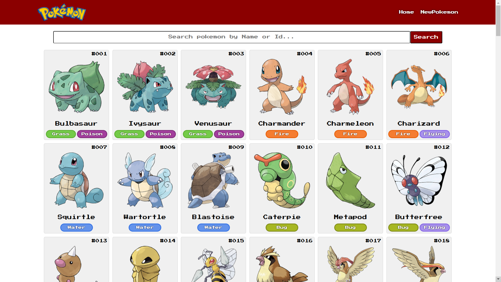

# Poke App

PokeApp es una aplicación de React que interactúa con la [PokeAPI](https://pokeapi.co/) para brindar una experiencia interactiva con los fanáticos de Pokémon. Esta aplicación utiliza componentes funcionales de React y enlaces como `useState()`, `useEffect()`, `useContext()` y `useParams()` para administrar el estado y los efectos secundarios.

## Características

- **Funcionalidad de búsqueda**: los usuarios pueden buscar Pokémon por nombre o ID.
- **Búsqueda Debounce**: experiencia de búsqueda mejorada con debounced inputs para optimizar las llamadas a la API.
- **Listado de Pokémon**: Lista de Pokémon generada dinámicamente con información detallada.
- **Temas de colores dinámicos**: Según el tipo de Pokémon.
- **SASS** - Para los estilos y mobile first.
- **Enrutamiento**: UI limpia y navegable con React Router.
- **Manejo de formularios**: Agrega nuevos Pokémon usando `react-hook-form`.

### Buscar
- Los usuarios pueden buscar Pokémon por nombre o ID.
- Dejar un nombre o id de Pokémon correcto en la entrada de búsqueda durante 2 segundos activará la búsqueda.
- Comprueba automáticamente que el pokemon a buscar no esté ya en la lista.

### Detalles
- Vista detallada de un Pokémon específico.
- El nombre, ID, imagen, tipos, etc., se pasan a través de parámetros de consulta (search/id?name=...)
- La descripción se obtiene de un endpoint diferente de PokeAPI.

## Tecnologías / Herramientas usadas

- [React](https://reactjs.org/) - El framework web utilizado
- [PokeAPI](https://pokeapi.co/) - API para datos de Pokémon
- [React Router](https://reactrouter.com/) - Para navegación y enrutamiento
- [Formulario de React Hook](https://react-hook-form.com/) - Para manejo y validación de formularios
- [SASS](https://sass-lang.com/) - Para los estilos